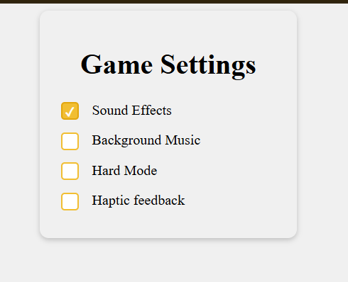

# Game Settings Panel Design

A simple front-end mockup for a game settings panel with toggle options for audio, difficulty, and gameplay preferences.

## Features
- Clean card-style layout
- Custom checkbox styling
- Responsive, centered design
- Minimal HTML and CSS structure

## Files
- `index.html` – page structure and settings controls
- `styles.css` – styling for the layout and checkboxes

## Run locally
1. Open `index.html` in a browser, or
2. Serve the project with a local web server in the project folder.

## Project purpose
This is a lightweight UI design example for learning HTML and CSS layout patterns.

